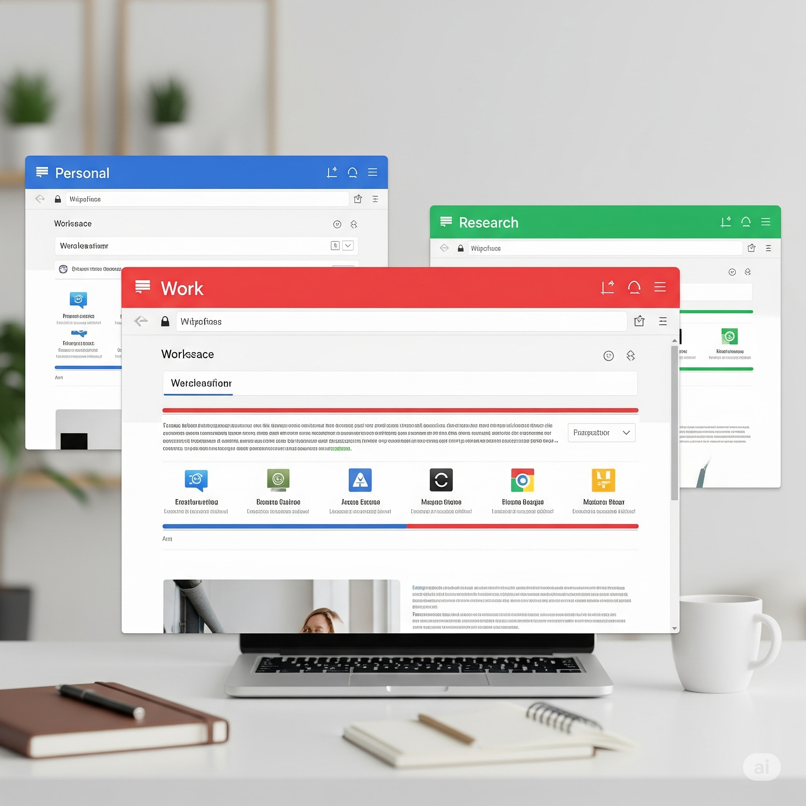

# chrome-eazy

**Supercharge your browser workflow by transforming your Chrome windows into distinct, color-coded workspaces.**

`chrome-eazy` is a Chrome extension designed for users who juggle multiple projects, tasks, or contexts. It allows you to assign a unique name and color to each Chrome window, creating a persistent visual indicator that helps you instantly recognize and switch between your workspaces.



---

## Features

- **🎨 Name & Color-Code Windows:** Assign a memorable name and a distinct color to any Chrome window to create a "workspace".
- **📌 Persistent Visual Headers:** A clean, colored header with the workspace name is injected at the top of every tab within a workspace, ensuring you never lose context.
- **🏠 Workspace Homepage:** A beautiful, grid-based homepage gives you a bird's-eye view of all your active workspaces and the tabs within them.
- **⚡️ Quick Navigation:** Click on any tab from the homepage to instantly jump to that tab and focus its window.
- **🧹 Automatic Cleanup:** Workspace data is automatically removed from storage when you close a window, keeping things tidy.

---

## Installation

Since the extension is in active development, you'll need to load it manually in Chrome's developer mode.

1.  **Download the Code:** Clone or download this repository to your local machine.
    ```bash
    git clone [https://github.com/toxicoder/chrome-eazy.git](https://github.com/toxicoder/chrome-eazy.git)
    ```
2.  **Open Chrome Extensions:** Open Google Chrome and navigate to `chrome://extensions`.
3.  **Enable Developer Mode:** In the top-right corner of the Extensions page, toggle on **Developer mode**.
4.  **Load the Extension:** Click the **"Load unpacked"** button that appears and select the `chrome-eazy` directory you just downloaded.

The `chrome-eazy` icon should now appear in your Chrome toolbar.

---

## How to Use

1.  **Create a Workspace:**
    - Click the `chrome-eazy` icon in your Chrome toolbar to open the popup.
    - Give your current window a name (e.g., "Project Phoenix", "Social Media").
    - Pick a color that you'll associate with this workspace.
    - Click **"Save & Apply"**. A colored header will now appear on all tabs in this window.

2.  **View All Workspaces:**
    - In the popup, click the **"View All Workspaces"** link.
    - This opens the homepage where you can see all your active workspaces in a grid.
    - Click any tab listed on the homepage to switch directly to it.

---

## Contributing

This project is being built with the assistance of a cutting-edge coding LLM. Development is guided by a series of concise, bite-sized tasks. If you're interested in contributing, please refer to the project's issue tracker or development plan for the next available task.

---

## License

This project is licensed under the MIT License. See the [LICENSE](LICENSE) file for details.
